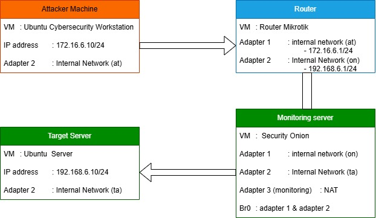

# Baseline Report - Phase 1 (Hardening & Baseline)

## Informasi Umum

- Proyek: TEK1314-2025-Kel-6-Kelas-F2
- Mata Kuliah: Keamanan Siber
- Skenario: Remote Access Security Management Server
- Periode Pelaksanaan: Minggu 4-7
- Status: Selesai

## Tujuan Phase 1

Phase 1 bertujuan membangun baseline lab yang stabil dan aman sebelum pengujian kerentanan dan simulasi insiden dilakukan.

1. Menetapkan topologi dan konfigurasi IP antar VM.
2. Menjalankan hardening dasar pada target server.
3. Mengamankan layanan SSH dengan port non-default (2222).
4. Memvalidasi konektivitas dan kontrol akses setelah hardening.
5. Memastikan aktivitas terekam di Security Onion.

## Arsitektur Baseline

### Konfigurasi Jaringan

- Network Segments:
  - Attacker LAN: 172.16.6.0/24
  - Target LAN: 192.168.6.0/24
- Subnet Mask: 255.255.255.0
- Environment: Isolated Cybersecurity Lab (router-based segmentation)

### Tabel Host dan Peran

| Hostname | IP Address(es) | OS | Role |
|----------|----------------|----|------|
| Ubuntu Cybersecurity Workstation | 172.16.6.10 | Ubuntu | Attacker Machine |
| Router (Mikrotik) | 172.16.6.1 / 192.168.6.1 | Router OS | Router / Gateway |
| Ubuntu Server | 192.168.6.10 | Ubuntu Server | Target Server |
| Security Onion | 172.16.6.30 / 192.168.6.30 | Security Onion | Monitoring / SIEM |

## Aktivitas Implementasi

### 1) Setup Topologi dan Security Onion

- Menyiapkan 4 VM (Attacker, Router, Target, Security Onion).
- Melakukan instalasi dan aktivasi Security Onion.
- Memastikan Security Onion dapat memantau trafik lab.

Evidence:
- 
- 

### 2) Konfigurasi IP dan Validasi Dasar

- Menetapkan IP target server sesuai rencana.
- Melakukan ping test untuk validasi konektivitas awal.
- Memastikan dashboard monitoring aktif.

Evidence:
- 
- 
- 
- 

### 3) Pre-Hardening Assessment

- Menguji kondisi sebelum hardening (ping, status service, nmap, ufw).

Evidence:
- 
- 
- 
- 

### 4) Hardening SSH, UFW, dan Kernel

- Mengaktifkan UFW dan verifikasi rule firewall.
- Melakukan hardening SSH (penggunaan port 2222 dan pembatasan akses).
- Menerapkan hardening kernel via sysctl.
- Validasi proteksi dengan pengujian SSH port 2222 dan monitoring Fail2Ban.

Evidence:
- 
- 
- 
- 
- 

## Hasil Baseline

1. Topologi 4 komponen berjalan pada dua segmen jaringan.
2. Security Onion aktif dan mampu menampilkan aktivitas jaringan.
3. Hardening berhasil diterapkan pada SSH, firewall, dan kernel.
4. SSH pada target berjalan menggunakan port 2222 untuk kebutuhan skenario pengujian.

## Kesimpulan

Phase 1 menghasilkan baseline jaringan dan keamanan yang siap digunakan untuk:

1. Phase 2 (Vulnerability Assessment)
2. Phase 3 (Incident Response)

Baseline ini menjadi acuan untuk validasi celah, simulasi serangan, dan evaluasi respons insiden.

