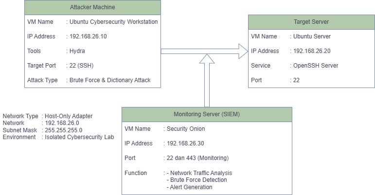

# Baseline Report - Phase 1: Hardening Review
**Kelompok 6 - Kelas F2**  
**Mata Kuliah**: TEK1314 Keamanan Siber  
**Tanggal**: [Diisi tanggal pengumpulan]

---

## 1. Pendahuluan

### 1.1 Tujuan Hardening
[Jelaskan tujuan dari implementasi hardening pada infrastruktur lab]

### 1.2 Ringkasan Infrastruktur
- **Network Subnet**: 192.168.26.0/24
- **Jumlah VM**: 3 sistem
- **Skenario**: Remote Access Security Management Server
- **Attack Type**: Brute Force & Dictionary Attack terhadap SSH

### 1.3 Standar Keamanan
[Jelaskan standar atau best practice yang digunakan sebagai acuan]

---

## 2. Network Hardening

### 2.1 Topologi Jaringan


**Deskripsi Topologi**:
- [Jelaskan alur jaringan dan komunikasi antar sistem]

### 2.2 Konfigurasi Firewall

#### 2.2.1 Ubuntu Server (Target - 192.168.26.20)
**Firewall**: UFW / iptables  
**Status**: [Aktif/Nonaktif]

**Aturan yang Diterapkan**:
```bash
# [Masukkan output dari: sudo ufw status verbose]
# Atau: sudo iptables -L -v -n
```

**Screenshot**:


**Penjelasan**:
- Port yang diizinkan: [List port dan alasan]
- Port yang diblokir: [List port dan alasan]

#### 2.2.2 Security Onion (SIEM - 192.168.26.30)
**Konfigurasi Khusus**: [Jelaskan konfigurasi monitoring interface]

#### 2.2.3 Attacker Machine (192.168.26.10)
**Isolasi Network**: Host-Only Adapter

### 2.3 Segmentasi Jaringan
[Jelaskan strategi segmentasi jaringan yang diterapkan]

---

## 3. System Hardening

### 3.1 Ubuntu Server (192.168.26.20)

#### 3.1.1 Identitas Sistem
- **Hostname**: [Contoh: SRV-SSH-KEL06F]
- **IP Address**: 192.168.26.20
- **OS**: Ubuntu Server [versi]

**Bukti**:
```bash
# [Output dari: hostname]
# [Output dari: ip addr show]
```


#### 3.1.2 Layanan yang Dinonaktifkan
**Daftar Layanan**:
```bash
# [Output dari: systemctl list-unit-files --state=disabled]
```


**Alasan**: [Jelaskan mengapa layanan tertentu dinonaktifkan]

#### 3.1.3 Konfigurasi User & Privilege
- **Root Login**: [Enabled/Disabled]
- **Sudo Users**: [List user dengan privilege sudo]
- **Password Policy**: [Jelaskan jika ada password policy]

#### 3.1.4 SSH Hardening
**File Konfigurasi**: /etc/ssh/sshd_config

**Parameter Keamanan**:
```bash
# [Output dari: cat /etc/ssh/sshd_config | grep -v "^#" | grep -v "^$"]
```


**Setting Penting**:
- PermitRootLogin: [yes/no]
- PasswordAuthentication: [yes/no]
- Port: [22 atau custom]
- [Setting lainnya]

#### 3.1.5 Security Updates
**Status Update**:
```bash
# [Output dari: apt list --upgradable]
```


**Patch Terakhir**: [Tanggal update terakhir]

### 3.2 Security Onion (192.168.26.30)

#### 3.2.1 Identitas Sistem
- **Hostname**: [Hostname Security Onion]
- **IP Address**: 192.168.26.30
- **Management Interface**: [Interface name]
- **Monitoring Interface**: [Interface name]

#### 3.2.2 Konfigurasi Monitoring
[Jelaskan konfigurasi monitoring yang diterapkan]

### 3.3 Attacker Machine (192.168.26.10)

#### 3.3.1 Identitas Sistem
- **Hostname**: [Hostname]
- **IP Address**: 192.168.26.10
- **Tools Installed**: Hydra, [tools lainnya]

---

## 4. Bukti Logging - Minggu ke-5

### 4.1 Instalasi Security Onion
**Status**: [Berhasil/Dalam Proses]


### 4.2 Dashboard Security Onion
**Platform**: Sguil / Squert  
**Access URL**: https://192.168.26.30


### 4.3 ICMP Traffic Capture Test

#### 4.3.1 Skenario Test
- **Source**: Attacker Machine (192.168.26.10)
- **Destination**: Ubuntu Server (192.168.26.20)
- **Protocol**: ICMP (Ping)
- **Command**: `ping -c 10 192.168.26.20`

#### 4.3.2 Bukti Eksekusi Ping


#### 4.3.3 Log di Security Onion


**Informasi Log**:
- **Timestamp**: [Timestamp dari log]
- **Source IP**: 192.168.26.10
- **Destination IP**: 192.168.26.20
- **Protocol**: ICMP
- **Details**: [Detail tambahan dari log]

### 4.4 Verifikasi Sistem Monitoring
**Kesimpulan**: [Jelaskan bahwa Security Onion sudah berfungsi dengan baik untuk merekam traffic jaringan]

---

## 5. Checklist Hardening (Before Attack)

### 5.1 Network Hardening
- [ ] Firewall dikonfigurasi dengan aturan ketat
- [ ] Port yang tidak perlu diblokir
- [ ] Network segmentation diterapkan
- [ ] Monitoring interface Security Onion aktif

### 5.2 System Hardening
- [ ] Layanan yang tidak perlu dinonaktifkan
- [ ] SSH dikonfigurasi dengan setting aman
- [ ] Root login via SSH dinonaktifkan
- [ ] User privilege dikonfigurasi (non-root dengan sudo)
- [ ] Security patches ter-update
- [ ] Password policy diterapkan

### 5.3 Identitas & Standar
- [ ] IP Address sesuai segmen kelompok (192.168.26.x)
- [ ] Hostname sesuai format (SRV-SSH-KEL06F)
- [ ] Dokumentasi lengkap

### 5.4 Logging & Monitoring
- [ ] Security Onion terinstal dan aktif
- [ ] Dashboard dapat diakses
- [ ] Traffic ICMP berhasil direkam
- [ ] Log menampilkan timestamp, source, dan destination

---

## 6. Kesimpulan

### 6.1 Ringkasan Implementasi
[Ringkasan dari semua langkah hardening yang telah diterapkan]

### 6.2 Kesiapan Sistem
[Pernyataan bahwa sistem sudah siap untuk masuk ke fase berikutnya (vulnerability assessment dan attack simulation)]

### 6.3 Kendala yang Dihadapi
[Jika ada kendala selama implementasi, jelaskan di sini beserta solusinya]

---

## Lampiran

### A. Referensi Screenshot
- [01-topology.png] - Diagram topologi jaringan
- [02-firewall-server.png] - Konfigurasi firewall server
- [03-disabled-services.png] - Daftar layanan yang dinonaktifkan
- [04-security-onion-dashboard.png] - Dashboard Security Onion
- [05-ping-test-command.png] - Eksekusi ping test
- [06-ping-log-siem.png] - Log ICMP di Security Onion
- [07-hostname-server.png] - Verifikasi hostname
- [08-ssh-config.png] - Konfigurasi SSH
- [09-ip-config.png] - Konfigurasi IP address
- [10-security-updates.png] - Status security updates

### B. File Konfigurasi
[List file konfigurasi yang relevan]

### C. Command Reference
[Daftar command yang digunakan untuk hardening dan verifikasi]

---

**Disusun oleh**:  
Kelompok 6 - Kelas F2  
[Daftar nama anggota kelompok]

**Tanggal**: [Tanggal pengumpulan]
